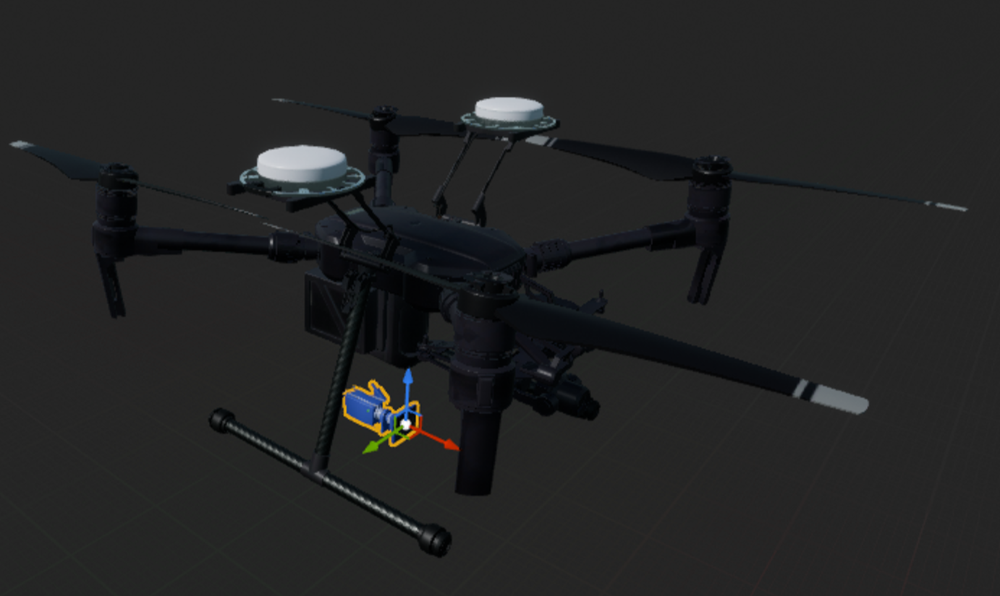

# airsim_roscpp_pkgs

For internal use, don't use this in open source version as of now
##  Setup 
- Ubuntu 16.04 + ROS Kinetic. WSL works fine as well
- Deps:
`$ sudo apt-get install ros-kinetic-mavros-msgs`

##  Build
- Build AirSim 
```
cd $(AIRSIM_ROOT);
./setup.sh;
./build.sh;
cd $(AIRSIM_ROOT)/Unity;
./build.sh;
```
- Build ROS package

```
# set compiler to clang
export CXX=/usr/bin/clang++-5.0
mkdir -p airsim_ros_ws/src && cd $_
git clone https://github.com/madratman/airsim_roscpp_pkgs.git
cd ../
catkin_make # or catkin build
```

## Setup for Windows Subsystem for Linux for running RViz, rqt_image_view, terminator 
- Install [Xming X Server](https://sourceforge.net/projects/xming/). 
- Run "XLaunch" from Windows start menu. Select `Multiple Windows` in first popup, `Start no client` in second, **ONLY** `Clipboard` in third popup. Do not select `Native Opengl`.  
- Install terminator : `sudo apt-get install terminator` and [learn how to split windows](http://www.ubuntugeek.com/terminator-multiple-gnome-terminals-in-one-window.html)
- Open Ubuntu 16.04 session, and enter `$ DISPLAY=:0 terminator -u`. 

## Running
```
cd airsim_ros_ws
source devel/setup.bash
roslaunch airsim_ros_pkgs airsim_with_simple_PID_position_controller.launch
rviz -d rviz/default.rviz
```
## Compute disparity using stereo_image_proc
- `ROS_NAMESPACE=front rosrun stereo_image_proc stereo_image_proc`
- View disparity `rosrun image_view stereo_view stereo:=/front image:=image_rect_color`
- Read stereo_image_proc's [documentation](https://wiki.ros.org/stereo_image_proc)
- Improve disparity/depth: [Choose good stereo params](https://wiki.ros.org/stereo_image_proc/Tutorials/ChoosingGoodStereoParameters)

# ROS API
## AirSim ROS Wrapper Node
### Publishers:
- `/global_gps` [sensor_msgs/NavSatFix](https://docs.ros.org/api/sensor_msgs/html/msg/NavSatFix.html) -- TODO: description
- `/home_geo_point` [airsim_ros_pkgs/GPSYaw]() -- TODO: description
- `/imu_ground_truth` [sensor_msgs/Imu](https://docs.ros.org/api/sensor_msgs/html/msg/Imu.html) -- TODO: description
- `/odom_local_ned` [nav_msgs/Odometry](https://docs.ros.org/api/nav_msgs/html/msg/Odometry.html) -- TODO: description
- `/vehicle_state` [mavros_msgs/State](https://docs.ros.org/api/mavros_msgs/html/msg/State.html) -- TODO: description
- `/front/left/camera_info` [sensor_msgs/CameraInfo](https://docs.ros.org/api/sensor_msgs/html/msg/CameraInfo.html) -- TODO: description
- `/front/left/image_raw` [sensor_msgs/Image](https://docs.ros.org/api/sensor_msgs/html/msg/Image.html) -- TODO: description
- `/front/right/camera_info` [sensor_msgs/CameraInfo](https://docs.ros.org/api/sensor_msgs/html/msg/CameraInfo.html) -- TODO: description
- `/front/right/image_raw` [sensor_msgs/Image](https://docs.ros.org/api/sensor_msgs/html/msg/Image.html) -- TODO: description
- `/front/left/depth_planar` [sensor_msgs/Image](https://docs.ros.org/api/sensor_msgs/html/msg/Image.html) -- TODO: description
- `/tf` [tf2_msgs/TFMessage](https://docs.ros.org/api/tf2_msgs/html/msg/TFMessage.html) -- TODO: description

### Subscribers:
- `/gimbal_angle_euler_cmd` [airsim_ros_pkgs/GimbalAngleEulerCmd] -- TODO: description
- `/gimbal_angle_quat_cmd` [airsim_ros_pkgs/GimbalAngleQuatCmd] -- TODO: description
- `/vel_cmd_body_frame` [airsim_ros_pkgs/VelCmd] -- TODO: description
- `/vel_cmd_world_frame` [airsim_ros_pkgs/VelCmd] -- TODO: description

### Services:
- `/land` [TODO: type] -- TODO: description
- `/reset` [TODO: type] -- TODO: description
- `/takeoff` [TODO: type] -- TODO: description

### Parameters:
- `/front_left_calib_file` [string] -- Default: `airsim_ros_pkgs/calib/front_left_480x640.yaml`
- `/front_right_calib_file` [string] -- Default: `airsim_ros_pkgs/calib/front_right_480x640.yaml`
- `/update_airsim_control_every_n_sec` [double] -- TODO: description
- `/update_airsim_img_response_every_n_sec` [double] -- TODO: description
- `/max_horz_vel` [double] -- TODO: description
- `/max_vert_vel_` [double] -- TODO: description

## Simple PID Position Controller Node 

### Parameters:
- `/max_vel_horz_abs` [double] -- TODO: description
- `/max_vel_vert_abs` [double] -- TODO: description
- `/kp_x` [double] -- TODO: description
- `/update_control_every_n_sec` [TODO: type] -- TODO: description

### Services:
- `/airsim_node/gps_goal` [Request: airsim_ros_pkgs/GPSYaw] -- TODO: description
- `/airsim_node/local_position_goal` [Request: airsim_ros_pkgs/XYZYaw] -- TODO: description

### Subscribers:
- `/airsim_node/home_geo_point` [airsim_ros_pkgs/GPSYaw] -- TODO: description
- `/airsim_node/odom_local_ned` [nav_msgs/Odometry](https://docs.ros.org/api/nav_msgs/html/msg/Odometry.html) -- TODO: description

### Publishers:
- `/vel_cmd_world_frame` [airsim_ros_pkgs/VelCmd] -- TODO: description


## AirSim camera settings 
### Changing camera parameters 
- Frame of reference
The camera positions are defined in a **left-handed coordinate frame** as shown in the image below. +X-axis is along "body front", +Y-axis is along "body right", +Z axis is along "body up" direction.  


- Stereo   
[This page](https://support.stereolabs.com/hc/en-us/articles/360007395634-What-is-the-camera-focal-length-and-field-of-view-) enlists the possible resolutions, and corresponding focal lengths and field of views.   
You can change the default stereo pair pose, image resolution, and _horizontal_ FoV under the "front-left" and "front-right" fields in `Documents\AirSim\Settings.json`. The default parameters are according the `WVGA` settings as [detailed here](https://support.stereolabs.com/hc/en-us/articles/360007395634-What-is-the-camera-focal-length-and-field-of-view-).   
More details on AirSim's settings is [available here](https://microsoft.github.io/AirSim/docs/settings/).   
Defaults are (X,Y,Z are in **meters**. ZED's baseline is 12 centimeters, hence we have `-0.06` and `0.06` in Y axis of front_left and front_right):
  * for front-left:
  	```
      "front-left": {
        "CaptureSettings": [
          {
            "ImageType": 0,
            "Width": 672,
            "Height": 376,
            "FOV_Degrees": 87
          }
        ],
        "X": 0.25, "Y": -0.06, "Z": 0.10,
        "Pitch": 0.0, "Roll": 0.0, "Yaw": 0.0
      },
	```

  * for front-right:
  	```
      "front-right": {
        "CaptureSettings": [
          {
            "ImageType": 0,
            "Width": 672,
            "Height": 376,
            "FOV_Degrees": 87
          }
        ],
        "X": 0.25, "Y": 0.06, "Z": 0.10,
        "Pitch": 0.0, "Roll": 0.0, "Yaw": 0.0
      }
	```


## Changing camera lens configuration 
- Not supported yet
